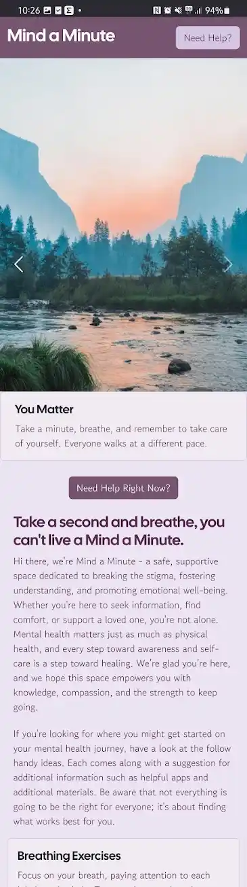
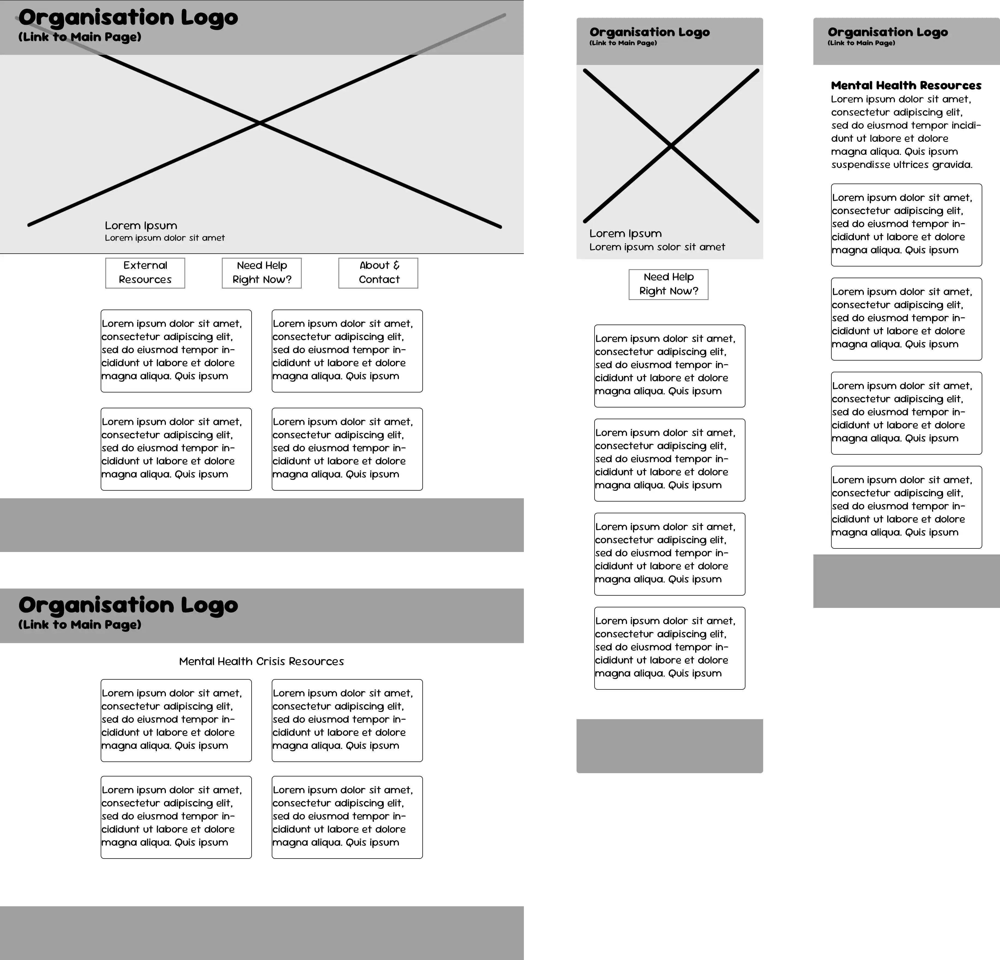
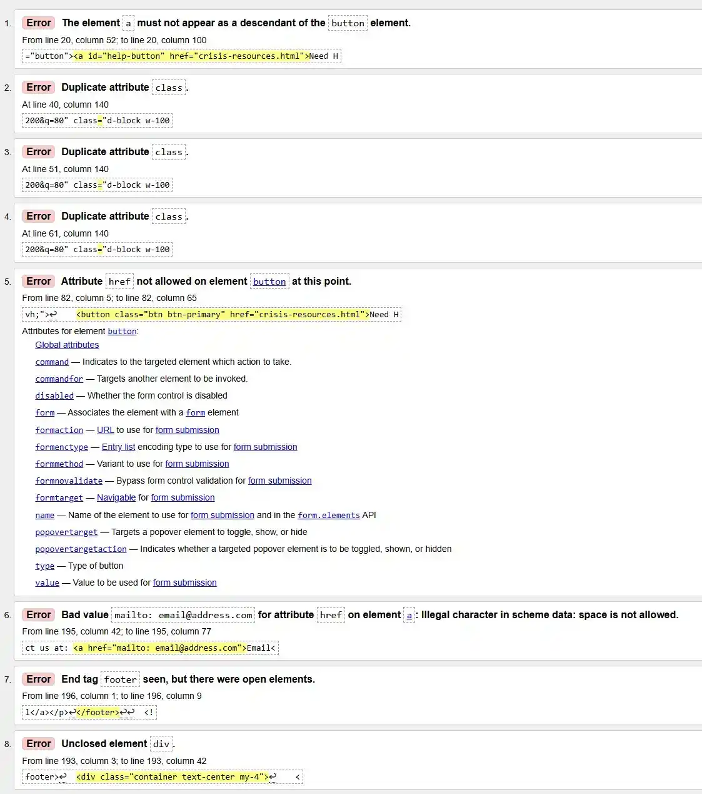
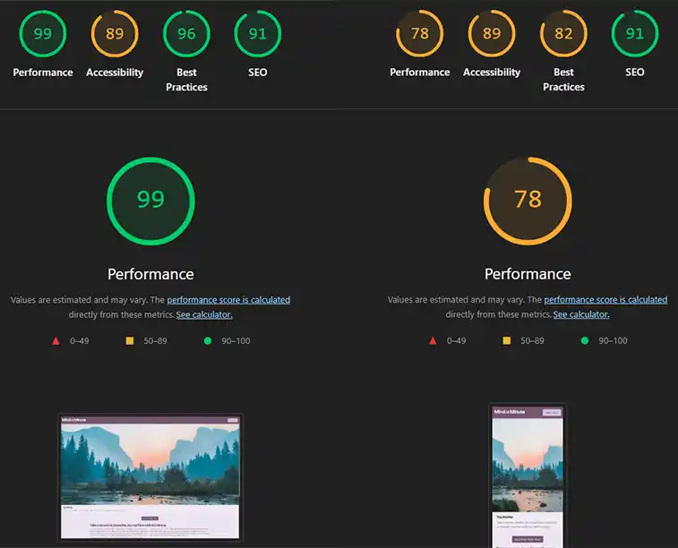
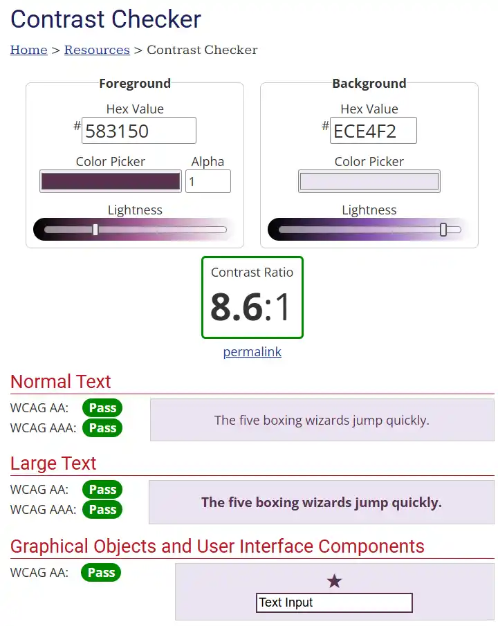

# 🧠 Mental Health Awareness Website

A responsive and informative website aimed at promoting mental health awareness, providing resources, and encouraging open conversations. Built with HTML, CSS, JavaScript, and Bootstrap 5.

---

## 🔗 Live Demo

[View the Live Website](https://sourtarte.github.io/mental-health-awareness)



---
## 📌 Table of Contents


- [Features](#🌟%20features)
- [Tech Stack](#🧰%20Tech%20Stack)
- [Project Planning](#📋%20%Project%20Planning)
- [Testing](#🧪%20Testing)
- [Folder Structure](#📂%20Folder%20Structure)
- [Contributing](#🤝%20Contributing)
- [License](#📃%20License)
---
## 🌟 Features

- Clean, modern, responsive layout
- Informational sections about mental health topics
- Call-to-action banners encouraging conversation
- Resource links for professional help
- Bootstrap components for fast and accessible design
- Mobile-friendly navigation and layout
---
## 🧰 Tech Stack

- **HTML5**
- **CSS3**
- **Bootstrap 5**
- **JavaScript (Vanilla)**
- **Google Fonts**
- **Font Awesome**
---
## 📋 Project Planning

The start of this project was heralded with the first hurdle of outlining the needs of those who would use the site. Alongside fairly standard concerns of site responsiveness, and readability, there were a few types of user taken into account, as outlined in the [project board](https://github.com/users/SourTarte/projects/3/views/1) of this repo.

After that, wireframing was tackled using photoshop, as it was more time efficient than learning new software. Using it, a representation of the final site's layout was created, as seen below, though this would be subject to change.



---
## 🧪 Testing

After having finished the layout of the page, the deployed site was ran through W3C's HTML and CSS validation steps. The CSS returned no results, but the HTML returned 8, which were then remedied same-day.




Then Google Chrome's lighthouse tools were used to measure a general set of performance metrics.




Lighthouse's accessibility metrics indicated the contrast ratios were poor for certain users, and so they were also tested using WebAIM's contrast ratio checking tool.



---
## 📂 Folder Structure
```
.
└── mental-health-awareness/
    ├── assets/
    │   ├── css/
    │   │   └── style.css
    │   └── readme-imgs/
    │       ├── contrast-check.webp
    │       ├── html-validation-errors.webp
    │       ├── lighthouse-metrics.webp
    │       ├── main-page-screenshots.webp
    │       └── wireframe-layout.webp
    ├── .gitignore
    ├── README.md
    ├── crisis-resources.html
    └── index.html
```

---
## 📃License

Cal Sans, Font Copyright (c) 2021, The Cal Sans Project Authors (https://github.com/calcom/font)
Gowun Dodum, Font Copyright (c) 2021, The Gowun Dodum Project (https://github.com/yangheeryu/Gowun-Dodum)

All images made available under [CC0 license](https://creativecommons.org/public-domain/cc0/).
